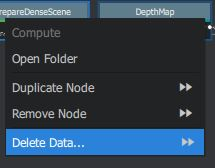
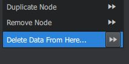
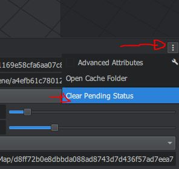

Error: Graph is being computed externally
=========================================

Unexpected exit of Meshroom while processing can cause the "Graph is being computed externally" problem.`#249`_

.. _#249: https://github.com/alicevision/meshroom/issues/249

The Start and Stop buttons are greyed out. 

Background:
When Meshroom is terminated unexpectedly, files are left in the cache folders. When you open such a project, Meshroom will think, based on the residual files, that parts of the pipeline are computed externally. (This feature ([Renderfarm](https://github.com/alicevision/meshroom/wiki/Large-scale-dataset)) is not included in the binary Release 2019.1.0)
So the buttons are greyed out because Meshroom is waiting for an external source to compute the graph.
Obviously, this won´t go anywhere.
This behaviour can also occur, when you modify nodes in the advanced mode while the graph is being computed.

To fix this problem, first try to 'Clear Submitted Status' by clicking on the bad node (right click->delete data).

If this does not work, also clear the submitted statuses of the following nodes (right click->delete data >>>)

You have a menu on the top-right of the graph widget with "Clear Pending Status" to do it **on all nodes** at once.

Alternatively, go to the cache folder of your project and delete the contents of the node folders starting with the node where Meshroom stopped working (marked in dark green). You can keep successful computed results (light green).
Now you can continue computing the graph on your computer.

