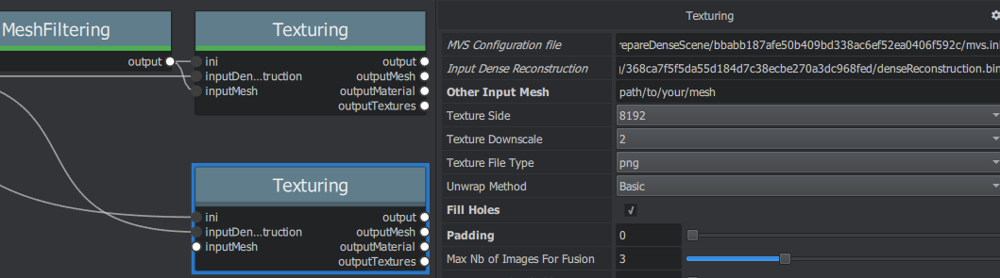

Texturing after external re topology
====================================

It is possible to reproject textures after re-topology and custom
unwrap. The only constraint is to **NOT** modify scale/orientation of
the model, in order to stay in the same 3D space as the original
reconstruction.

To retexture a user mesh, your need to remove the input connection on
Texturing node's ``inputMesh`` (right click connection > Remove) and
write the path to your mesh in the attribute editor. If you have custom
UVs, they will be taken into account.

You can also duplicate the original Texturing node (right click >
Duplicate) and make changes on this copy. It should look like this:
|image|

*(optional) You can also set ``Padding`` to 0 and check ``Fill Holes``
instead if you want to completely fill texture's blank space with
plausible values.*

