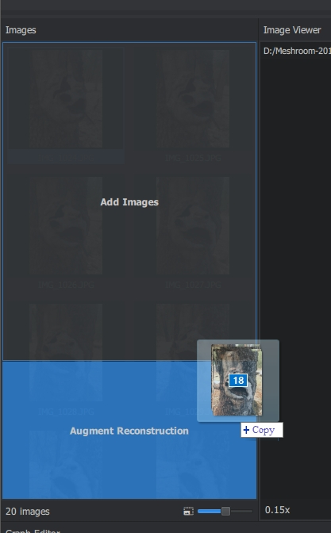

Augment Reconstruction
======================

You can drag-n-drop additional images into the lower part of the **Images** Pane, called **Augment Reconstruction**. For each batch of images, a new **Group** will be created in the **Images** Pane. You can drop successive batches of N images in the **Images** Pane.
for each batch of images the graph will branch.

You can use this method for complex scenes with multiple objects

.. note:: Images can not be added while processing

.. note:: The groups will be merged using the ImageMatchingMultiSfM node. Read the node description for details

.. image:: graph.jpg

.. image:: images.jpg
