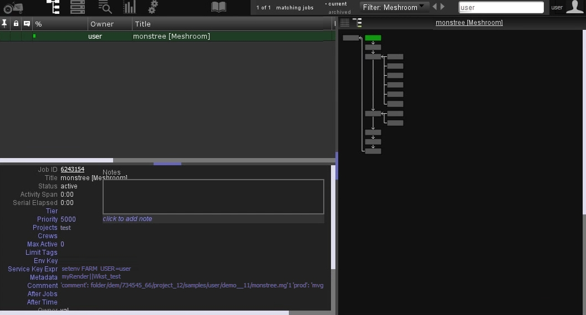

External Reconstruction
=======================

.. image:: submit.jpg

Use this option when you compute externally after submission to a render farm from meshroom. 
(need to have access to a renderfarm and need the corresponding submitter).

This way, you can make use of external computing power. 
If you can not compute GPU nodes locally (no cuda) you can still submit them.

Available submitters:

- Pixar Renderman Tractor
- Fireworks (https://materialsproject.github.io/fireworks/)

WIP