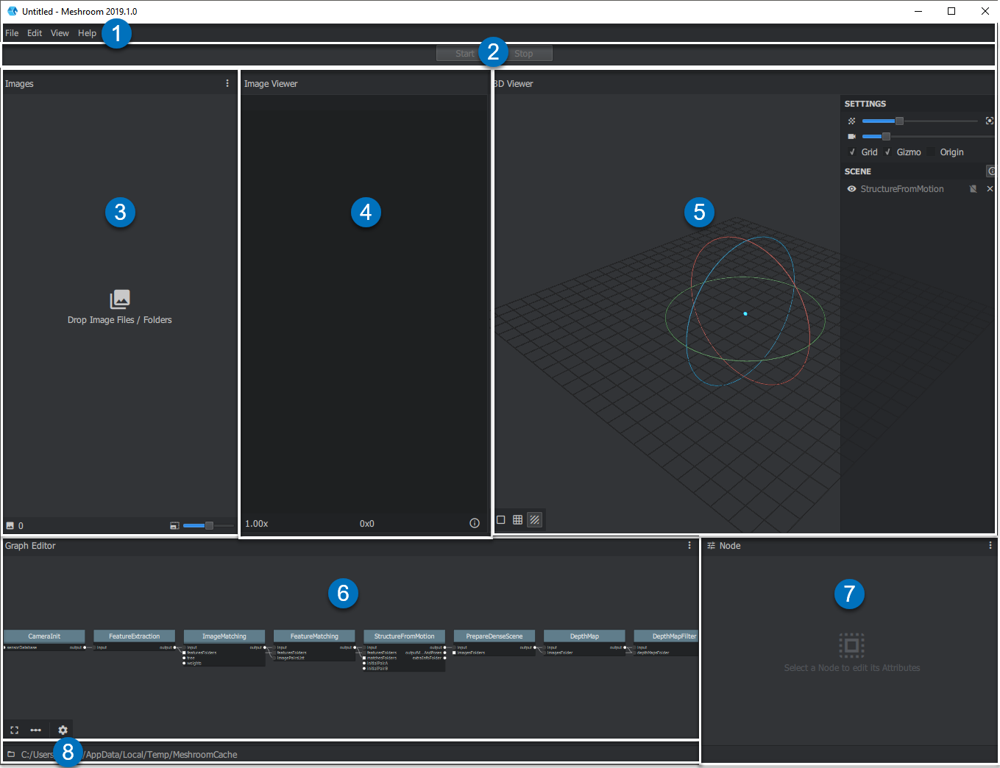

The Graphical User Interface (GUI)
==================================

When you first start Meshroom, two windows open:

the main graphical user interface with different panes
and in the background the Command-line interface window.

.. |01| image:: 01.png

|01| Menu bar: File / View / About

|02| Start/Pause/Stop/(Submit) *processing with progress bar below*

|03| Images *Pane*

|04| Image Viewer *Pane*

|05| 3D Viewer *Pane*

|06| Graph Editor *Pane*

|07| Graph Editor Properties *Pane*

|08| Cache Folder File Path *(where temp files and final results are stored)*

You can grab a Pane border |cursor2| and move it to change the **pane** size. 
