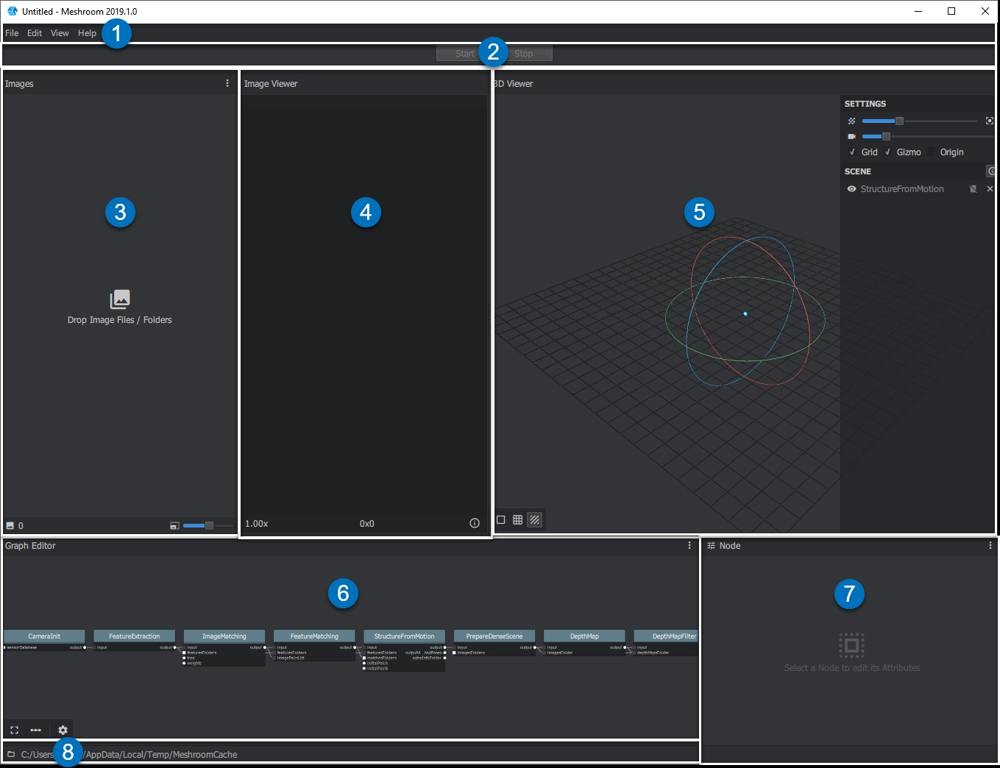

The Graphical User Interface (GUI)
==================================

.. toctree::
   :maxdepth: 1
   :hidden:
   
   add-images/add-images
   reconstruction-start/reconstruction-start
   3dviewer/3dviewer
   augment-reconstruction/augment-reconstruction
   live-reconstruction/live-reconstruction
   external-reconstruction/external-reconstruction
   advanced-node/advanced-node
   import-old/import-old

When you first start Meshroom, two windows open:

* the Command-line interface window (You can ignore or minimize this window. Do not close this window or Meshroom will terminate).
* the main Graphical User Interface (GUI) with different panes:

.. |01| image:: 01.jpg

.. |03| image:: 03.jpg
.. |04| image:: 04.jpg

.. |cursor2| image:: cursor2.jpg

|01| Menu bar: File / View / About

|02| Start/Pause/Stop/(Submit) *processing with progress bar below*

|03| Images *Pane*

|04| Image Viewer *Pane*

|05| 3D Viewer *Pane*

|06| Graph Editor *Pane*

|07| Graph Editor Properties *Pane*

|08| Cache Folder File Path *(where temp files and final results are stored)*

You can grab a Pane border |cursor2| and move it to change the **pane** size. 
