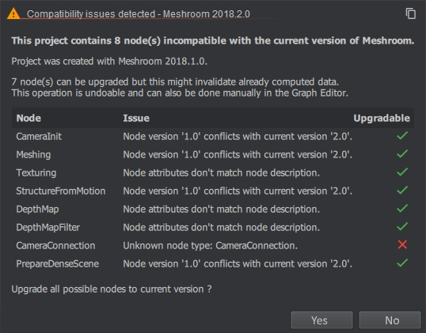
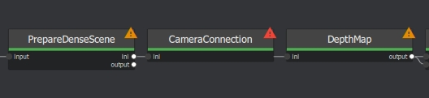

Import old Meshroom project
===========================

Projects created in an older version of Meshroom can be imported.

- CameraConnection node has been removed in v2019.1. You need to reconnect the neighboring nodes.

- With a new release of Meshroom, some nodes might require an update to the new version.

- Projects created in a newer version may become incompatible with an older version.

