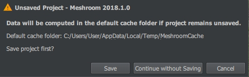

macOS
========

Most of macOS workstations do not have any NVIDIA graphic boards, hence they cannot run CUDA, for MVS part.
So compiling and using Meshroom is
`not exactly straightforward <https://github.com/alicevision/AliceVision/issues/444>`__.
However, Ryan Baumann has compiled his own
`Homebrew tap <http://github.com/ryanfb/homebrew-alicevision>`__ which includes
the necessary formulae, and you can use this post to get an idea of how to use
them to get up and running. Note that this is intended as a first step
for Mac users wishing to experiment with *and improve* the
AliceVision/Meshroom software, and as a result these instructions may
become outdated with time.

.. image:: homebrew.jpg


System Requirements
```````````````````

First off, your Mac will currently need some NVIDIA GPU with a CUDA
compute capability of 2.0 or greater. This is probably a pretty small
portion of all Macs available, but you can check your GPU by looking in
“About This Mac” from the Apple icon in the top left corner of the
screen, under “Graphics”. If you have an NVIDIA GPU listed there, you
can check its compute capability on `the NVIDIA CUDA GPUs
page <https://developer.nvidia.com/cuda-gpus>`__.

Second, you’re going to need to install `the latest CUDA
toolkit <https://developer.nvidia.com/cuda-downloads>`__. As of this
writing, that’s CUDA 10.1, which is only officially compatible with OS X
10.13 (High Sierra), so you may also need to upgrade to the latest
version of High Sierra (but not Mojave!) if you haven’t already.
Alongside this it is aloso suggested to instal the latest NVIDIA CUDA GPU
webdriver, which as of this writing is
`387.10.10.10.40.118 <https://www.nvidia.com/download/driverResults.aspx/142160/en-us>`__.

Third, `CUDA 10.1 is only compatible with the version of ``clang``
distributed with Xcode
10.1 <https://docs.nvidia.com/cuda/cuda-installation-guide-mac-os-x/index.html>`__,
and will refuse to compile against anything else. You may have an older
or newer version of Xcode installed. As of this writing, if you fully
update Xcode within a fully updated OS X install, you’ll have Xcode
10.1. To get back to Xcode 10.1, what you can do is go to `Apple’s
Developer Downloads page <https://developer.apple.com/download/more/>`__
(for which you’ll need a free Apple developer account), then search for
“Xcode 10.1”, then install the Command Line Tools for Xcode 10.1 package
for your OS version. After installing, run
``sudo xcode-select --switch /Library/Developer/CommandLineTools`` and
then verify that ``clang --version`` shows
``Apple LLVM version 10.0.0``.

Once you’ve done all this, you can verify a working CUDA install by
going to ``/Developer/NVIDIA/CUDA-10.1/samples/1_Utilities/deviceQuery``
and running ``sudo make && ./deviceQuery``, which should output your GPU
information. If it doesn’t build correctly (i.e. you see
``nvcc fatal   : The version ('??.?') of the host compiler ('Apple clang') is not supported``),
or ``deviceQuery`` errors or doesn’t list your GPU, you may need to look
over the steps above and check that everything is up to date (you can
also check the CUDA panel in System Preferences).

.. image:: homebrew-inst.jpg

The following instructions also assume a working
`Homebrew <https://brew.sh/>`__ install.


macOS Installation
``````````````````

If you’ve followed all the above setup instructions and requirements,
installing the AliceVision libraries/framework should be as easy as:

.. code::

   brew install ryanfb/alicevision/alicevision


Meshroom Installation & Usage
`````````````````````````````

This tutorial does not provide a Homebrew formulae for the `Meshroom package
itself <https://github.com/alicevision/meshroom>`__, as it’s all Python
and doesn’t seem particularly difficult to install/use once AliceVision
is installed and working correctly. Just follow the install instructions
there (for my specific Python configuration/installation I used ``pip3``
instead of ``pip`` and ``python3`` instead of ``python``):

.. code::

   wget 'https://github.com/alicevision/meshroom/archive/v2019.1.0.zip'
   unzip v2019.1.0.zip
   cd meshroom-2019.1.0
   pip install -r requirements.txt

.. note::

    The CUDA-linked AliceVision binaries invoked by Meshroom don’t automatically find the CUDA libraries on the ``DYLD_LIBRARY_PATH``, and setting the ``DYLD_LIBRARY_PATH`` from the shell launching Meshroom doesn’t seem to get the variable passed into the shell environment Meshroom uses to spawn commands. Without this, you’ll get an error like:

.. code::

   dyld: Library not loaded: @rpath/libcudart.10.1.dylib
     Referenced from: /usr/local/bin/aliceVision_depthMapEstimation
     Reason: image not found

In order to get around this, you can symlink the CUDA libraries into
``/usr/local/lib`` (most of the other workarounds I found for
permanently modifying the ``DYLD_LIBRARY_PATH`` seemed more confusing or
fragile than this simpler
approach):\ `1 <https://ryanfb.github.io/etc/2018/08/17/alicevision_and_meshroom_on_mac_os_x.html#fn:dyldpath>`__

.. code::

   for i in /Developer/NVIDIA/CUDA-10.1/lib/*.a /Developer/NVIDIA/CUDA-10.1/lib/*.dylib; do ln -sv "$i" "/usr/local/lib/$(basename "$i")"; done

You can undo/uninstall this with:

.. code::

   for i in /Developer/NVIDIA/CUDA-10.1/lib/*.a /Developer/NVIDIA/CUDA-10.1/lib/*.dylib; do rm -v "/usr/local/lib/$(basename "$i")"; done

You may also want to download the voctree dataset:

.. code::

   curl 'https://gitlab.com/alicevision/trainedVocabularyTreeData/raw/master/vlfeat_K80L3.SIFT.tree' -o /usr/local/Cellar/alicevision/2.1.0/share/aliceVision/vlfeat_K80L3.SIFT.tree

Then launch with:

.. code::

   ALICEVISION_SENSOR_DB=/usr/local/Cellar/alicevision/2.1.0/share/aliceVision/cameraSensors.db ALICEVISION_VOCTREE=/usr/local/Cellar/alicevision/2.1.0/share/aliceVision/vlfeat_K80L3.SIFT.tree PYTHONPATH=$PWD python meshroom/ui

Import some photos, click “Start”, wait a while, and hopefully you
should end up with a reconstructed and textured mesh (`here’s an example
of my own which I uploaded to SketchFab <https://skfb.ly/6ARpx>`__). By
default, the output will be in ``MeshroomCache/Texturing/`` (relative to
where you saved the project file).

By default, the output will be in MeshroomCache/Texturing/
(relative to where you saved the project file).

When you launch Meshroom
*without*
sudo, the temp path will be something like this:



When starting with sudo, it will be /tmp/MeshroomCache by default


Footnotes:
----------

1. Previously, I suggested modifying ``meshroom/core/desc.py`` so that
   `the return value at the end of the ``buildCommandLine``
   method <https://github.com/alicevision/meshroom/blob/develop/meshroom/core/desc.py#L368>`__
   instead reads:

   .. code::

      return 'DYLD_LIBRARY_PATH="/Developer/NVIDIA/CUDA-10.1/lib" ' + cmdPrefix + chunk.node.nodeDesc.commandLine.format(**chunk.node._cmdVars) + cmdSuffix

   ` <https://ryanfb.github.io/etc/2018/08/17/alicevision_and_meshroom_on_mac_os_x.html#fnref:dyldpath>`__

--------------

Originally published on 2018-08-17 by `Ryan
Baumann <https://ryanfb.github.io/>`__

This guide was updated on 2019-03-20 to reflect the latest CUDA 10.1 and
Xcode 10.1 versions. The Homebrew formula was also updated to
AliceVision 2.1.0 to support Meshroom 2019.1.0.

Modified for the Meshroom documentation 2019-07-25

Baumann, Ryan. “AliceVision and Meshroom on Mac OS X.” *Ryan Baumann -
/etc* (blog), 17 Aug 2018,
https://ryanfb.github.io/etc/2018/08/17/alicevision\ *and*\ meshroom\ *on*\ mac\ *os*\ x.html
(accessed 25 Jul 2019).
