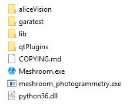

Windows
=======

1. Download Meshroom from `Meshroom home page <https://alicevision.org/#meshroom>`_

2. extract ZIP to a folder of your choice

3. You can start Meshroom by clicking on the executable. No extra installation is required.

.. Note::
  Do not run Meshroom as Admin. This will disable drag-and-drop.
