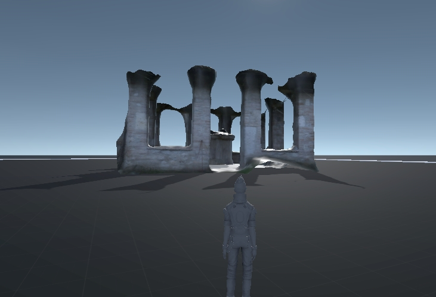

View and Edit Models
====================

Meshlab
-------

*You can drag and drop different OBJ and PLY files as layers.*

.. image:: 10000000000002800000016EE902B71EB0CF756B.jpg

*So in this case I have a layer for both the final mesh and the SFM points/cameras. Sometimes the mesh smoothing step can be a little too aggressive so I find it useful to compare between the original mesh and the smooth mesh. If the mesh looks broken, the PLY sfm data and the OBJ meshes are great for tracing through the pipeline.*

clean up / delete / smooth

The first thing you want to do is to rotate your model and align it with the coordinate system.

You can import the obj into
`Meshlab <http://www.meshlab.net/#download>`_
then go to
**Filters ``>`` Normals, Curvatures **
and
**Orientation ``>`` Transform: Rotate**
** **
and align it yourself from there.
** **

There might be some parts of the model or the scene you want to remove.

You can select ….. then remove...

`http://www.banterle.com/francesco/courses/2017/be_3drec/slides/Meshlab.pdf <http://www.banterle.com/francesco/courses/2017/be_3drec/slides/Meshlab.pdf>`_

`http:// <http://www.scanner.imagefact.de/tut/meshlabTut.pdf>`_

`www.scanner.imagefact.de/tut/meshlabTut.pdf <http://www.scanner.imagefact.de/tut/meshlabTut.pdf>`_

.. image:: 100000000000077C0000040C97D48F1AB92F97AD.jpg

Smooth mesh

If you don't like the smoothing results from Meshroom, you can smooth the mesh yourself.

`http://www.cs.cmu.edu/~reconstruction/advanced.html#meshlab <http://www.cs.cmu.edu/~reconstruction/advanced.html#meshlab>`_

Tutorials by
`Mister P. MeshLab Tutorials <https://www.youtube.com/channel/UC70CKZQPj_ZAJ0Osrm6TyTg>`_
`MeshLab Basics: Navigation <https://www.youtube.com/watch?v=Sl0vJfmj5LQ>`_

`MeshLab Basics: Selection, part one <https://www.youtube.com/watch?v=xj3MN7K6kpA>`_

`MeshLab Basics: Selection, part two <https://www.youtube.com/watch?v=Bc3GdJ6Ddsc>`_

`Cleaning: Triangles and Vertices Removal <https://www.youtube.com/watch?v=m2nmeJj5Ij4>`_

`Cleaning: Basic filters <https://www.youtube.com/watch?v=aoDLrXp1sfY>`_

`Mesh Processing: Decimation <https://www.youtube.com/watch?v=PWM6EGVVNQU>`_
`Meshlab Processing: Smoothing <https://www.youtube.com/watch?v=4mwm9eMJaXY>`_

`MeshLab Basics: Scale to real measures <https://www.youtube.com/watch?v=6psAppbOOXM>`_

Blender
-------

For detailed instructions visit the
`blender homepage <https://www.blender.org/>`_
or the
`blender  <https://www.youtube.com/user/BlenderFoundation>`_
`youtube channel <https://www.youtube.com/user/BlenderFoundation>`_
**.**

Here is a quick tutorial on how to optimize photogrammetry objects inside Blender: How to
3D
Photoscan Easy and Free!

`https://www.youtube.com/watch?v=k4NTf0hMjtY <https://www.youtube.com/watch?v=k4NTf0hMjtY>`_

meshing filtering 10:18 / 13:17 blender import

https://www.youtube.com/watch?v=RmMDFydHeso

Meshroom2Blender Blender Plugin
-------------------------------

Blender importer for AliceVision Meshroom

datafiles: cameras, images, sparse pointcloud and obj's.

Basic implementation of Meshroom importer. If you have sophisticated node tree it will use only the first nodes from the file. Addon assumes you did compute each stages/nodes, and the output is same. Visit
`the Github project site <https://github.com/tibicen/meshroom2blender>`_
for details.

.. image:: 1000000000000637000002EDAEB94E9E7F951D6B.jpg

BlenderLandscape
----------------

Addon for Blender 2.79b. 3DSurvey Collection of tools to improve the work-flow of a 3D survey (terrestrial or UAV photogrammetry). Import multiple objs at once (with correct orientation), for instance a bunch of models made in Meshroom.
`https://github.com/zalmoxes-laran/BlenderLandscape <https://github.com/zalmoxes-laran/BlenderLandscape>`_

Instant Meshes
--------------

`https://github.com/wjakob/instant-meshes <https://github.com/wjakob/instant-meshes>`_

includes quick intro

why do we want to use it?
It is a really fast auto-retopology solution and helps you create more accurate meshes

.. image:: cco.jpg

CloudCompare
------------

3D point cloud and mesh processing software 

Open Source Project

`https://www.danielgm.net/cc/ <https://www.danielgm.net/cc/>`_

`http://www.danielgm.net/cc/release/ <http://www.danielgm.net/cc/release/>`_

tutorial

http://www.danielgm.net/cc/tutorials.html

.. image:: 10000000000001C500000221611D09A26B69269B.jpg

Export model to Unity
---------------------

Start Unity, open your project and your asset folder.

Navigate in the file Explorer of your OS to the assets subfolder where you want to store your Photogrammetry object.

Copy the model.obj and texture.jpg (or other supported file types) from the Meshroom Export folder to the Unity assets subfolder.

Open Unity and wait for the auto-import to complete.

You might want to optimize your mesh
and texture for ingame use.

Now you can add your model to the scene.

There is a little more to do to create a simple demo game, like adding a Mesh collider, optimize the texture,...

For detailed instructions visit the
`Unity homepage <https://unity3d.com>`_
.

Here is a manual on how to optimize photogrammetry objects inside Unity:
`Unity Photogrammetry Workflow <https://unity3d.com/files/solutions/photogrammetry/Unity-Photogrammetry-Workflow_2017-07_v2.pdf>`_
.. image:: 100000000000076E00000401AC14E84A53702851.jpg

Export to Maya (Plugin)
-----------------------

**MeshroomMaya**
(v0.4.2) is a Maya plugin that enables to model 3D objects from images.

`https://github.com/alicevision/MeshroomMaya <https://github.com/alicevision/MeshroomMaya>`_

This plugin is not available at the moment.

Use the Export to Maya node instead.

Alembic bridge
~~~~~~~~~~~~~~

*Export from Meshroom for Maya*

Use the Export to Maya node to export the Alembic ABC file

*Import in Nuke/Mari*

In menu "NukeMVG ``>`` Import Alembic" , .abc file can be loaded. The tool create the graph of camera projection. Result can be export to Mari via Nuke <-> Mari bridge.

.. image:: 1000000000000500000002D057790BC5AE108E3F.jpg

SideFX Houdini Plugin
---------------------

An implementation of *Alicevision* is available in Houdini as part of the (free) GameDevelopmentToolset.

You can find Installation Instructions on the following page:
`https://www.sidefx.com/tutorials/alicevision-plugin/ <https://www.sidefx.com/tutorials/alicevision-plugin/>`_

Review (german):

`https://www.digitalproduction.com/2019/02/26/alicevision-photogrammetrie-in-houdini/ <https://www.digitalproduction.com/2019/02/26/alicevision-photogrammetrie-in-houdini/>`_

Students can download the free learning edition called
`  <https://www.sidefx.com/products/compare/>`_
`Houdini Apprentice <https://www.sidefx.com/products/compare/>`_
. This is a node-locked license that has all the features of Houdini FX with some restrictions such as a limited render size and a watermark on final renderings.
