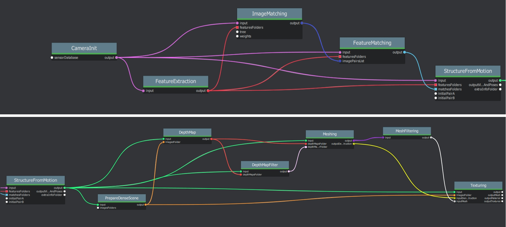

Connect Nodes
=============

Default graph
-------------

The node connections of the **default Graph** can be difficult to understand. The following images illustrate how the nodes are connected. 

.. image:: default-node-graph-color1original.jpg

This image illustrates the default graph with node connections on the origin nodes:

How to use Draft Meshing
------------------------

.. image:: draft-meshing-node-graph.jpg

.. image:: draft-meshing-node-graph-color.jpg

Panorama graph
------------------------

.. image:: panorama-node-graph.JPG
