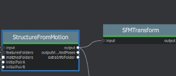

SfMTransform
============

**Description**

Transform/Scale SfM using given transformation, cameras, landmarks, markers.
Can be used to scale SfM to real-world size.

settings

========================= ===========================================================================================================
Name                      Description
========================= ===========================================================================================================
Input                     SfMData file
Transformation Method     Transformation method:

                          * transformation: Apply a given transformation
                      
                          * auto_from_cameras: Use cameras
                      
                          * **auto_from_landmarks**: Use landmarks
                      
                          * from_single_camera: Use a specific camera as the origin of the coordinate system
                      
                          * from_markers: Align specific markers to custom coordinates
Transformation            Required only for 'transformation' and 'from_single_camera' methods:
                      
                          * transformation: Align [X,Y,Z] to +Y-axis, rotate around Y by R deg, scale by S; syntax: X,Y,Z;R;S
                      
                          * from_single_camera: Camera UID or image filename
Landmarks Describer Types Image describer types used to compute the mean of the point cloud. (only for "landmarks" method).
                          (**'sift'**, 'sift_float', 'sift_upright', **'akaze'**, 'akaze_liop', 'akaze_mldb', 'cctag3', 'cctag4',
                          'sift_ocv', 'akaze_ocv')
Additional Scale          Additional scale to apply. (0.0-100.0, default **1.0**)  
Markers                   Markers alignment points
Scale                     Apply scale transformation.
Rotation                  Apply rotation transformation.
Translation               Apply translation transformation.
Verbose Level             verbosity level (fatal, error, warning, **info**, debug, trace).
========================= ===========================================================================================================

**usage:**

|image0|

