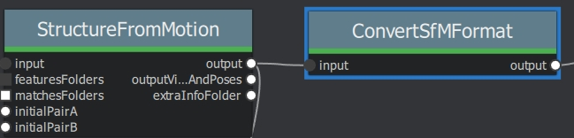
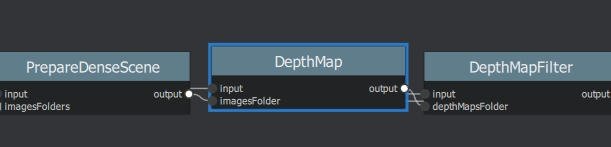
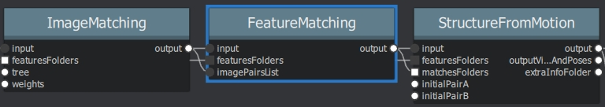
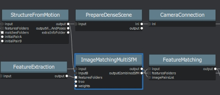
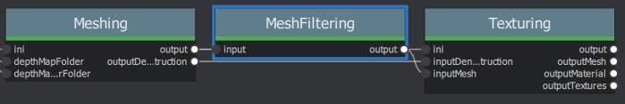
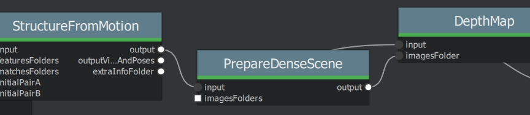
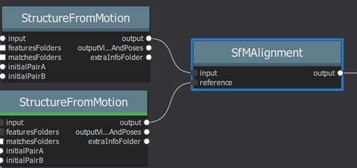
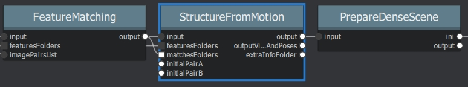

Complete Node List
===================

Note: Some parameters are exposed for development purposes.

Nodes/features marked with an # are not supported/implemented in the current release

\* in default pipeline \**tested and working ? not tested

CameraCalibration (#)
---------------------
**Description**

Note: This node requires AliceVision compiled with opencv. Not included in the MR 2019.1 binary.

The internal camera parameters can be calibrated from multiple views of a checkerboard. This allows to retrieve focal length, principal point and distortion parameters. A detailed explanation is presented in [opencvCameraCalibration].

[opencvCameraCalibration] http://docs.opencv.org/3.0-beta/doc/tutorials/calib3d/camera_calibration/camera_calibration.html

.. csv-table:: settings
   :header: "Name", "Description"
   :widths: 15, 30

   "Input", "Input images in one of the following form:
   -- folder containing images
   -- image sequence like ""/path/to/seq.@.jpg""
   -- video file"
   "Pattern", "Type of pattern (camera calibration patterns)
   - CHESSBOARD
   - CIRCLES
   - ASYMMETRIC_CIRCLES
   - ASYMMETRIC_CCTAG"
   "Size", "(Size of the Pattern) - Number of inner corners per one of board dimension like Width Height"
   "Square Size", "Size of the grid's square cells (0-100mm)"
   "Nb Distortion Coef", "Number of distortion coefficient (0-5)"
   "Max Frames", "Maximal number of frames to extract from the video file (0-5)"
   "Calib Grid Size", "Define the number of cells per edge (0-50)"
   "Max Calib Frames", "Maximal number of frames to use to calibrate from the selected frames (0-1000)"
   "Min Input Frames", "Minimal number of frames to limit the refinement loop  (0-100)"
   "Max Total Average Error", "Max Total Average Error (0-1)"
   "Debug Rejected Img Folder", "Folder to export delete images during the refinement loop"
   "Debug Selected Img Folder", "Folder to export debug images"
   "Output", "Output filename for intrinsic [and extrinsic] parameters (default filename cameraCalibration.cal)"

CameraInit
----------------
**Description**

-load image metadata and sensor information
You can mix multiple cameras and focal lengths.
The CameraInit will create groups of intrinsics based on the images metadata.
It is still good to have multiple images with the same camera and same focal lengths as it adds constraints on the internal cameras parameters.
But you can combine multiple groups of images, it will not decrease the quality of the final model.1

Note: In some cases, some image(s) have no serial number to identify the camera/lens device. This makes it impossible to correctly group the images by device if you have used multiple identical (same model) camera devices.
The reconstruction will assume that only one device has been used, so if 2 images share the same focal length approximation they will share the same internal camera parameters.
If you want to use multiple cameras, add a corresponding serialnumber to the EXIF data.

.. csv-table:: settings
   :header: "Name", "Description"
   :widths: 15, 30
   
   "Viewpoints Input", " viewpoints(1 Element for each loaded image)
	- ID
	- Pose ID
	- Image Path
	- Intrinsic: Internal Camera Parameters (Intrinsic ID)
	- Rig (-1 - 200)
	- Rig Sub-Pose: Rig Sub-Pose Parameters (-1 - 200)
	- Image Metadata: (list of metadata elements)"
  "Intrinsic Camera Intrinsics", "(1 Element for each loaded image)
    - ID
    - Initial Focal Length: Initial Guess on the Focal Length
    - Focal Length: Known/Calibrated Focal Length
    - Camera Type: pinhole', 'radial1', 'radial3', 'brown', 'fisheye4'
    - #Make: Camera Make (not included in this build, commented out)
    - #Model: Camera Model
    - #Sensor Width: Camera Sensor Width
    - Width: Image Width (0-10000)
    - Height: Image Height (0-10000)
    - Serial Number: Device Serial Number (camera and lens combined)
    - Principal Point: X (0-10000) Y(0-10000)
    - DistortionParams: Distortion Parameters
	- Locked(True/False): If the camera has been calibrated, the internal camera parameters (intrinsics) can be  locked. It should improve robustness and speedup the reconstruction."
  "Sensor Database", "Camera sensor width database path"
  "Default Field Of View", "Empirical value for the field of view in degree 45° (0°-180°)"
  "Verbose Level", "verbosity level (fatal, error, warning, info, debug, trace)"
  "Output SfMData File", ".../cameraInit.sfm"

**Notes**

Issue: structure from motion reconstruction appears distorted, and has failed to aligned some groups of cameras when loading images without focallength

Solution: Keep the " Focal Length" init value but set the "Initial Focal Length" to -1 if you are not sure of the value.

https://github.com/alicevision/meshroom/issues/434

CameraLocalization (?)
----------------------

**Description**

Based on the SfM results, we can perform camera localization and retrieve the motion of an animated camera in the scene of the 3D reconstruction.
This is very useful for doing texture reprojection in other software as part of a texture clean up pipeline.
Could also be used to leverage Meshroom as a 3D camera tracker as part of a VFX pipeline

https://alicevision.github.io/#photogrammetry/localization

.. csv-table:: settings
  :header: Name, Description

  SfM Data,The sfm_data.json kind of file generated by AliceVision
  Media File,The folder path or the filename for the media to track
  Visual Debug Folder,If a folder is provided it enables visual debug and saves all the debugging info in that folder
  Descriptor Path,Folder containing the descriptors for all the images (ie the .desc.)
  Match Desc Types,"Describer types to use for the matching:
  sift', 'sift_float', 'sift_upright', 'akaze', 'akaze_liop', 'akaze_mldb', 'cctag3', 'cctag4', 'sift_ocv', 'akaze_ocv"
  Preset,"Preset for the feature extractor when localizing a new image (low, medium, normal, high, ultra)"
  Resection Estimator,"The type of /sac framework to use for resection (acransac, loransac)"
  Matching Estimator,"The type of /sac framework to use for matching (acransac, loransac)"
  Calibration,Calibration file
  Refine Intrinsics,Enable/Disable camera intrinsics refinement for each localized image
  Reprojection Error,Maximum reprojection error (in pixels) allowed for resectioning. If set to 0 it lets the ACRansac select an optimal value (0.1 - 50)
  Nb Image Match,[voctree] Number of images to retrieve in database (1 - 1000)
  Max Results,"[voctree] For algorithm AllResults, it stops the image matching when this number of matched images is reached. If 0 it is ignored (1 - 100)"
  Commonviews,[voctree] Number of minimum images in which a point must be seen to be used in cluster tracking (2 - 50)
  Voctree,[voctree] Filename for the vocabulary tree
  Voctree Weights,[voctree] Filename for the vocabulary tree weights
  Algorithm,"[voctree] Algorithm type: (FirstBest, AllResults)"
  Matching Error,[voctree] Maximum matching error (in pixels) allowed for image matching with geometric verification. If set to 0 it lets the ACRansac select an optimal value (0 - 50)
  Nb Frame Buffer Matching,[voctree] Number of previous frame of the sequence to use for matching (0 = Disable) (0 - 100)
  Robust Matching,"[voctree] Enable/Disable the robust matching between query and database images, all putative matches will be considered"
  N Nearest Key Frames,[cctag] Number of images to retrieve in the database Parameters specific for final (optional) bundle adjustment optimization of the sequence: (1-100)
  Global Bundle,"[bundle adjustment] If --refineIntrinsics is not set, this option allows to run a final global bundle adjustment to refine the scene"
  No Distortion,"[bundle adjustment] It does not take into account distortion during the BA, it consider the distortion coefficients all equal to 0"
  No BA Refine Intrinsics,[bundle adjustment] It does not refine intrinsics during BA
  Min Point Visibility,[bundle adjustment] Minimum number of observation that a point must have in order to be considered for bundle adjustment (2-50)
  Output Alembic,"Filename for the SfMData export file (where camera poses will be stored)
  desc.Node.internalFolder + 'trackedCameras.abc"
  Output JSON,Filename for the localization results as .json desc.Node.internalFolder + 'trackedCameras.json

CameraRigCalibration (?)
------------------------

**Description**

If a rig of cameras is used, we can perform the rig calibration. We localize cameras individually on the whole sequence. Then we use all valid poses to compute the relative poses between cameras of the rig and choose the more stable value across the images. Then we initialize the rig relative pose with this value and perform a global Bundle Adjustment on all the cameras of the rig. When the rig is calibrated, we can use it to directly localize the rig pose from the synchronized multi-cameras system with [Kneip2014] approaches.

..The rig calibration find the relative poses between all cameras used. It takes a point cloud as input and can
use both CCTag and SIFT features for localization. The implication is that all cameras must see features
(either SIFT or CCTag) that are part of the point cloud, but they do not have to observe overlapping regions. (See:POPART: Previz for Onset Production Adaptive Realtime Tracking)

“Given the position of the tracked reference frame relative to the motion capture system and the optical reference frames it is possible to retrieve the transformation between the tracked and the optical reference frames”1 “In practice, it is particularly difficult to make the tracked
frame coincident with the camera optical frame, thus a calibration procedure is needed to estimate this transformation and achieve the millimetric accuracy” [Chiodini et al. 2018]

[Chiodini et al. 2018] Chiodini, Sebastiano & Pertile, Marco & Giubilato, Riccardo & Salvioli, Federico & Barrera, Marco & Franceschetti, Paola & Debei, Stefano. (2018). Camera Rig Extrinsic Calibration Using a Motion Capture System. 10.1109/MetroAeroSpace.2018.8453603.
https://www.researchgate.net/publication/327513182_Camera_Rig_Extrinsic_Calibration_Using_a_Motion_Capture_System

https://alicevision.github.io/#photogrammetry/localization

[Kneip2011] 	A Novel Parametrization of the Perspective-Three-Point Problem for a Direct Computation of Absolute Camera Position and Orientation. L. Kneip, D. Scaramuzza, R. Siegwart. June 2011

[Kneip2013] 	Using Multi-Camera Systems in Robotics: Efficient Solutions to the NPnP ProblemL. Kneip, P. Furgale, R. Siegwart. May 2013

[Kneip2014] 	OpenGV: A unified and generalized approach to real-time calibrated geometric vision, L. Kneip, P. Furgale. May 2014.

[Kneip2014] 	Efficient Computation of Relative Pose for Multi-Camera Systems. L. Kneip, H. Li. June 2014

.. csv-table:: settings
  :header: Name, Description

  SfM Data,``The sfmData file``
  Media Path,The path to the video file, the folder of the image sequence or a text file (one image path per line) for each camera of the rig (eg. --mediapath /path/to/cam1.mov /path/to/cam2.mov)
  Camera Intrinsics,The intrinsics calibration file for each camera of the rig. (eg. --cameraIntrinsics /path/to/calib1.txt /path/to/calib2.txt)
  Export,Filename for the alembic file containing the rig poses with the 3D points. It also saves a file for each camera named 'filename.cam##.abc (trackedcameras.abc)
  Descriptor Path,Folder containing the .desc
  Match Describer Types,The describer types to use for the matching ``'sift', 'sift_float', 'sift_upright', 'akaze', 'akaze_liop', 'akaze_mldb', 'cctag3', 'cctag4', 'sift_ocv', 'akaze_ocv'``
  Preset,Preset for the feature extractor when localizing a new image (low, medium, normal, high, ultra)
  Resection Estimator,The type of /sac framework to use for resection (acransac,loransac)
  Matching Estimator,The type of /sac framework to use for matching (acransac,loransac)
  Refine Intrinsics,Enable/Disable camera intrinsics refinement for each localized image
  Reprojection Error,Maximum reprojection error (in pixels) allowed for resectioning. If set to 0 it lets the ACRansac select an optimal value. (0 - 10)
  Max Input Frames,Maximum number of frames to read in input. 0 means no limit (0 - 1000)
  Voctree,[voctree] Filename for the vocabulary tree
  Voctree Weights,[voctree] Filename for the vocabulary tree weights
  Algorithm,[voctree] Algorithm type: {FirstBest,AllResults}
  Nb Image Match,[voctree] Number of images to retrieve in the database (0 - 50)
  Max Results,[voctree] For algorithm AllResults, it stops the image matching when this number of matched images is reached. If 0 it is ignored (0 - 100)
  Matching Error,[voctree] Maximum matching error (in pixels) allowed for image matching with geometric verification. If set to 0 it lets the ACRansac select an optimal value (0 - 10)
  N Nearest Key Frames,[cctag] Number of images to retrieve in database (0 - 50)
  Output File,The name of the file where to store the calibration data (desc.Node.internalFolder + 'cameraRigCalibration.rigCal)

**Voctree Weights**: http://www.ipol.im/pub/art/2018/199/
voctree (optional): For larger datasets (>200 images), greatly improves image matching performances. It can be downloaded here.
https://github.com/fragofer/voctree You need to specify the path to vlfeat_K80L3.SIFT.tree in **Voctree**.

CameraRigLocalization (?)
-------------------------

**Description**

This node retrieves the transformation between the tracked and the optical reference frames.(?)
https://alicevision.github.io/#photogrammetry/localization

.. csv-table:: settings
  :header: Name, Description

  SfM Data,``The sfmData file``
  Media Path,The path to the video file, the folder of the image sequence or a text file (one image path per line) for each camera of the rig (eg. --mediapath /path/to/cam1.mov /path/to/cam2.mov)
  Rig Calibration File,The file containing the calibration data for the rig (subposes)
  Camera Intrinsics,The intrinsics calibration file for each camera of the rig. (eg. --cameraIntrinsics /path/to/calib1.txt /path/to/calib2.txt)
  Descriptor Path,Folder containing the .desc
  Match Describer Types,The describer types to use for the matching ``(sift', 'sift_float', 'sift_upright', 'akaze', 'akaze_liop', 'akaze_mldb', 'cctag3', 'cctag4', 'sift_ocv', 'akaze_ocv')``
  Preset,Preset for the feature extractor when localizing a new image ``(low, medium, normal, high, ultra)``
  Resection Estimator,The type of /sac framework to use for resection ``(acransac, loransac)``
  Matching Estimator,The type of /sac framework to use for matching ``(acransac, loransac)``
  Refine Intrinsics,Enable/Disable camera intrinsics refinement for each localized image
  Reprojection Error,Maximum reprojection error (in pixels) allowed for resectioning. If set to 0 it lets the ACRansac select an optimal value (0 - 10)
  Use Localize Rig Naive,Enable/Disable the naive method for rig localization: naive method tries to localize each camera separately
  Angular Threshold,The maximum angular threshold in degrees between feature bearing vector and 3D point direction. Used only with the opengv method (0 - 10)
  Voctree,[voctree] Filename for the vocabulary tree
  Voctree Weights,[voctree] Filename for the vocabulary tree weights
  Algorithm,[voctree] Algorithm type: ``{FirstBest,AllResults}``
  Nb Image Match,[voctree] Number of images to retrieve in the database
  Max Results,[voctree] For algorithm AllResults, it stops the image matching when this number of matched images is reached. If 0 it is ignored (0 - 100)
  Matching Error,[voctree] Maximum matching error (in pixels) allowed for image matching with geometric verification. If set to 0 it lets the ACRansac select an optimal value (0 - 10)
  N Nearest Key Frames,[cctag] Number of images to retrieve in database (0 - 50)
  Output Alembic,Filename for the SfMData export file (where camera poses will be stored) desc.Node.internalFolder + 'trackedcameras.abc

ConvertSfMFormat
----------------

**Description**

- creates abc', 'sfm', 'json', 'ply', 'baf SfM File from SfMData file

.. csv-table:: settings
  :header: Name, Description

  Input	, ``SfMData file``
  SfM File Format	,	SfM File Format ``(output file extension: abc', 'sfm', 'json', 'ply', 'baf)``
  Describer Types	,	Describer types to keep.``'sift', 'sift_float', 'sift_upright', 'akaze', 'akaze_liop', 'akaze_mldb', 'cctag3', 'cctag4', 'sift_ocv', 'akaze_ocv'``
  Image id	,	Image id
  Image White List	,	image white list (uids or image paths).
  Views	,	Export views
  Intrinsics	,	Export intrinsics
  Extrinsics	,	Export extrinsics
  Structure	,	Export structure
  Observations	,	Export observations
  Verbose Level	,	verbosity level ``(fatal, error, warning, info, debug, trace)``
  Output	,	Path to the output SfM Data file. (desc.Node.internalFolder + 'sfm.{fileExtension})

**Input nodes: StructureFromMotion:output``->``input:ConvertSfMFormat**

**Can I convert between Openmvg and alicevision SfM formats?**

OpenMVG and AliceVision json formats are very similar in the structure but not compatible right away as openmvg is a data serialization file among other things. https://github.com/alicevision/AliceVision/issues/600

DepthMap
--------

**Description**

####

.. csv-table:: settings
  :header: Name, Description

  ``MVS Configuration File:``,	SfMData file.
  Images Folder	,	Use images from a specific folder instead of those specify in the SfMData file.Filename should be the image uid.
  Downscale	,	Image downscale factor ``(1, 2, 4, 8, 16)``
  Min View Angle	,	Minimum angle between two views. ``(0.0, 10.0, 0.1)``
  Max View Angle	,	Maximum angle between two views. ``(10.0, 120.0, 1)``
  SGM: Nb Neighbour Cameras	,	Semi Global Matching: Number of neighbour cameras (1 - 100)
  SGM: WSH: Semi Global Matching	,	Half-size of the patch used to compute the similarity (1 - 20)
  SGM: GammaC	,	Semi Global Matching: GammaC Threshold (0 - 30)
  SGM: GammaP	,	Semi Global Matching: GammaP Threshold (0 - 30)
  Refine: Number of samples	,	(1 - 500)
  Refine: Number of Depths	,	(1 - 100)
  Refine: Number of Iterations	,	(1 - 500)
  Refine: Nb Neighbour Cameras	,	Refine: Number of neighbour cameras. (1 - 20)
  Refine: WSH	,	Refine: Half-size of the patch used to compute the similarity. (1 - 20)
  Refine: Sigma	,	Refine: Sigma Threshold (0 - 30)
  Refine: GammaC	,	Refine: GammaC Threshold. (0 - 30)
  Refine: GammaP	,	Refine: GammaP threshold. (0 - 30)
  Refine: Tc or Rc pixel size	,	Use minimum pixel size of neighbour cameras (Tc) or current camera pixel size (Rc)
  Verbose Level	,	verbosity level (fatal, error, warning, info, debug, trace)
  Output	,	Output folder for generated depth maps

**default:**

DepthMapFilter
--------------

**Description**

The original depth maps will not be entirely consistent. Certain depth maps will claim to see areas that are occluded by other depth maps. The DepthMapFilter step isolates these areas and forces depth consistency.

.. csv-table:: settings
  :header: Name, Description

  Input	,	SfMData file
  Depth Map Folder	,	Input depth map folder
  Number of Nearest Cameras	,	Number of nearest cameras used for filtering 10 (0 - 20)
  Min Consistent Cameras	,	Min Number of Consistent Cameras 3 (0 - 10)
  Min Consistent Cameras Bad Similarity	,	Min Number of Consistent Cameras for pixels with weak similarity value 4 (0 - 10)
  Filtering Size in Pixels	,	Filtering size in Pixels (0 - 10)
  Filtering Size in Pixels Bad Similarity	,	Filtering size in pixels (0 - 10)
  Verbose Level	,	verbosity level (fatal, error, warning, info, debug, trace)
  Output	,	Output folder for generated depth maps

**Min Consistent Cameras**
lower this value if the Meshing node has 0 depth samples input

**View Output**
open output folder and view EXR files

ExportAnimatedCamera
--------------------

**Description**

creates an Alembic  animatedCamera.abc file from SFMData (e.g. for use in 3D Compositing software)

.. csv-table:: settings
  :header: Name, Description

  ``Input SfMData``, ``SfMData file containing a complete SfM``
  SfMData Filter,	A SfMData file use as filter
  Export Undistorted Images	,	Export Undistorted Images value=True
  Undistort Image Format,	Image file format to use for undistorted images ``(*.jpg , *.jpg, *.tif, *.exr (half))``
  Verbose Level,	Verbosity level ``(fatal, error, warning, info, debug, trace)``
  Output filepath,	Output filepath for the alembic animated camera
  Output Camera Filepath,	Output filename for the alembic animated camera  internalFolder + 'camera.abc'

SFM``->``ExportAnimatedCamera
.. details https://www.youtube.com/watch?v=1dhdEmGLZhY

ExportMaya
----------

**Description**

Mode for use with MeshroomMaya plugin.

The node "ExportMaya" exports the undistorted images. This node has nothing dedicated to Maya but was used to import the data into our MeshroomMaya plugin. You can use the same to export to Blender.

.. csv-table:: settings
  :header: Name, Description

  Input SfM Data, sfm.sfm or sfm.abc
  Output Folder, Folder for MeshroomMaya output: undistorted images and thumbnails

ExportMaya: requires .sfm or .abc as input from ConvertSfMFormat

.. image:: export_maya.jpg

FeatureExtraction
-----------------

**Description**

FeatureMatching
---------------

**Description**

.. csv-table:: settings
  :header: Name, Description

  Input,SfMData file
  Features Folder,
  Features Folders, Folder(s) containing the extracted features and descriptors
  Image Pairs List,	Path to a file which contains the list of image pairs to match
  Describer Types,	Describer types used to describe an image ``**sift**'/ 'sift_float'/ 'sift_upright'/ 'akaze'/ 'akaze_liop'/ 'akaze_mldb'/ 'cctag3'/ 'cctag4'/ 'sift_ocv'/ 'akaze_ocv``
  Photometric Matching Method,	``For Scalar based regions descriptor ' * BRUTE_FORCE_L2: L2 BruteForce matching' ' * ANN_L2: L2 Approximate Nearest Neighbor matching ' * CASCADE_HASHING_L2: L2 Cascade Hashing matching ' * FAST_CASCADE_HASHING_L2: L2 Cascade Hashing with precomputed hashed regions (faster than CASCADE_HASHING_L2 but use more memory) 'For Binary based descriptor  ' * BRUTE_FORCE_HAMMING: BruteForce Hamming matching'``
  Geometric Estimator,	Geometric estimator: ``(acransac:  A-Contrario Ransac //  loransac: LO-Ransac (only available for fundamental_matrix model)``
  Geometric Filter Type,	Geometric validation method to filter features matches: ``**fundamental_matrix** // essential_matrix // homography_matrix /// homography_growing // no_filtering'``
  Distance Ratio,	``Distance ratio to discard non meaningful matches 0.8 (0.0 - 1)``
  Max Iteration,	Maximum number of iterations allowed in ransac step 2048 ``(1 - 20000)``
  Max Matches,	Maximum number of matches to keep ``(0 - 10000)``
  Save Putative Matches,	putative matches (True/False)
  Guided Matching,	the found model to improve the pairwise correspondences (True/False)
  Export Debug Files,	debug files (svg/ dot) (True/False)
  Verbose Level,	verbosity level (fatal/ error, warning, info, debug, trace)
  Output Folder,	Path to a folder in which computed matches will be stored

ImageMatching
---------------

**Description**

#########

.. csv-table:: settings
  :header: Name, Description

  Image	,	SfMData file
  Features Folders	,	Folder(s) containing the extracted features and descriptors
  Tree	,	Input name for the vocabulary tree file ALICEVISION_VOCTREE
  Weights	,	Input name for the weight file, if not provided the weights will be computed on the database built with the provided set
  Minimal Number of Images	,	Minimal number of images to use the vocabulary tree. If we have less features than this threshold, we will compute all matching combinations
  Max Descriptors	,	Limit the number of descriptors you load per image. Zero means no limit
  Nb Matches	,	The number of matches to retrieve for each image (If 0 it will retrieve all the matches) 50 (0-1000)
  Verbose Level	,	verbosity level (fatal, error, warning, info, debug, trace)
  Output List File	,	Filepath to the output file with the list of selected image pairs

.. image:: image_matching.jpg

ImageMatchingMultiSfM
---------------------

**Description**

This node can combine image matching between two input SfMData.

Used for **Live Reconstructin** and **Augmentation**

.. csv-table:: settings
  :header: Name, Description

  Input A	,	SfMData file
  Input B	,	SfMData file
  Features Folders	,	Folder(s) containing the extracted features and descriptors
  Tree	,	Input name for the vocabulary tree file ALICEVISION_VOCTREE
  Weights	,	Input name for the weight file if not provided the weights will be computed on the database built with the provided set
  Matching Mode	,	The mode to combine image matching between the input SfMData A and B: a/a+a/b for A with A + A with B. a/ab ['a/a+a/b' // 'a/ab' // 'a/b']
  Minimal Number of Images	,	Minimal number of images to use the vocabulary tree. If we have less features than this threshold we will compute all matching combinations
  Max Descriptors	,	Limit the number of descriptors you load per image. Zero means no limit 500 (0-100000)
  Nb Matches	,	The number of matches to retrieve for each image (If 0 it will retrieve all the matches) 50 (0-1000)
  Verbose Level	,	verbosity level (fatal // error // warning // info // debug // trace)
  Output List File	,	Filepath to the output file with the list of selected image pairs
  Output Combined SfM	,	Path for the combined SfMData file internalFolder + 'combineSfM.sfm

KeyframeSelection
-----------------

**Description**
Note: This is an experimental node for keyframe selection in a video, which removes too similar or too blurry images. This node is not yet provided in the binaries as it introduces many dependencies.
So if you built it by yourself, you can test the KeyframeSelection node. It is not yet fully integrated into Meshroom, so you have to manually drag&drop the exported frames to launch the reconstruction (instead of just adding a connection in the graph) ``https://github.com/alicevision/meshroom/issues/232``

MeshDecimate
------------

**Description**

Simplify your mesh to reduce mesh size without changing visual appearance of the model.

.. csv-table:: settings
  :header: Name, Description

  Input Mesh (OBJ file format),
  Simplification factor,	Simplification factor 0.5 (0 - 1)
  Fixed Number of Vertice,	Fixed number of output vertices 0 (0 - 1 000 000)
  Min Vertices,	Min number of output vertices 0 (0 - 1 000 000)
  Max Vertices,	Max number of output vertices 0 (0 - 1 000 000)
  Flip Normals,	Option to flip face normals 'It can be needed as it depends on the vertices order in triangles and the convention change from one software to another. (True/False)
  Verbose Level,	verbosity level (fatal // error // warning // info // debug // trace)
  Output mesh,	Output mesh (OBJ file format) internalFolder + 'mesh.obj

.. image:: mesh_decimate.jpg

or Meshing``->``MeshDecimate``->``MeshFiltering?

**Comparison MeshDecimate and MeshResampling**

.. image:: compare_resampling_decimate.jpg

**Flip Normals**

.. image:: flip_normals.jpg

MeshDenoising
-------------

**Description**

Denoise your mesh
Mesh models generated by 3D scanner always contain noise. It is necessary to remove the noise from the meshes.
Mesh denoising: remove noises, feature-preserving
``https://www.cs.cf.ac.uk/meshfiltering/index_files/Doc/Random%20Walks%20for%20Mesh%20Denoising.ppt``

.. csv-table:: settings
  :header: Name, Description

  input, Input Mesh (OBJ file format)
  Denoising Iterations, Number of denoising iterations ``(0, 30, 1) 5``
  Mesh Update Closeness Weight, ``Closeness weight for mesh update, must be positive ``(0.0, 0.1, 0.001) 0.001``
  Lambda, ``Regularization weight. (0.0 // 10.0 // 0.01) 2``
  Eta, ``Gaussian standard deviation for spatial weight, scaled by the average distance between adjacent face centroids. Must be positive.(0.0, 20.0, 0.01) 1.5``
  Mu, ``Gaussian standard deviation for guidance weight (0.0, 10.0, 0.01) 1.5``
  Nu, ``Gaussian standard deviation for signal weight. (0.0, 5.0, 0.01) 0.3``
  Mesh Update Method, ``Mesh Update Method * ITERATIVE_UPDATE (default): ShapeUp styled iterative solver * POISSON_UPDATE: Poisson-based update from [Want et al. 2015] (0, 1)``
  Verbose Level, ``['fatal', 'error', 'warning', 'info', 'debug', 'trace']``
  Output, ``Output mesh (OBJ file format).``

.. image:: mesh_denoising.jpg

Mesh Update Method
``https://www.researchgate.net/publication/275104101_Poisson-driven_seamless_completion_of_triangular_meshes``

MeshFiltering
-------------

**Description**

Filter out unwanted elements of your mesh

.. csv-table:: settings
  :header: Name, Description

  Input, Input Mesh (OBJ file format)
  Filter Large Triangles Factor, Remove all large triangles. We consider a triangle as large if one edge is bigger than N times the average edge length. Put zero to disable it. 60 (1 - 100)
  Keep Only the Largest Mesh, Keep only the largest connected triangles group (True/False)
  Nb Iterations, 5 (0 - 50)
  Lambda, 1 (0-10
  Verbose Level
  Verbose Level, ``['fatal', 'error', 'warning', 'info', 'debug', 'trace']``
  Output mesh, Output mesh (OBJ file format) internalFolder + 'mesh.obj

Note: "Keep Only The Largest Mesh". This is disabled by default in the 2019.1.0 release to avoid that the environment is being meshed, but not the object of interest. The largest Mesh is in some cases the reconstructed background. When the object of interest is not connected to the large background mesh it will be removed.
You should place your object of interest on a well structured non transparent or reflecting surface (e.g. a newspaper).

MeshResampling
---------------

**Description**

Reducing number of faces while trying to keep overall shape, volume and boundaries
You can specify a fixed, min, max Vertices number.

This is different from MeshDecimate!

Resampling ``https://users.cg.tuwien.ac.at/stef/seminar/MeshResamplingMerge1901.pdf``

.. csv-table:: settings
  :header: Name, Description

  Input, Input Mesh (OBJ file format)
  Simplification factor, ``Simplification factor 0.5 (0 - 1)``
  Fixed Number of Vertice, ``Fixed number of output vertices 0 (0 - 1 000 000)``
  Min Vertices, ``Min number of output vertices 0 (0 - 1 000 000)``
  Max Vertices, ``Max number of output vertices 0 (0 - 1 000 000)``
  Number of Pre-Smoothing Iteration, ``Number of iterations for Lloyd pre-smoothing 40 (0 - 100)``
  Flip Normals,  ``Option to flip face normals,  It can be needed as it depends on the vertices order in triangles and the convention change from one software to another.  (True/False)``
  Verbose Level, ``['fatal', 'error', 'warning', 'info', 'debug', 'trace']``
  Output mesh, ``Output mesh (OBJ file format) internalFolder + mesh.obj``

.. image:: mesh_resampling.jpg

**Comparison MeshDecimate and MeshResampling**

.. image:: compare_resampling_decimate.jpg

**Flip Normals**

.. image:: flip_normals.jpg

Meshing
-------

**Description**

none

.. image:: meshing.jpg

PrepareDenseScene
-----------------

**Description**

- This node undistorts the images and generates EXR images

.. csv-table:: settings
  :header: Name, Description

  Input,  SfMData file
  Verbose Level, ``['fatal', 'error', 'warning', 'info', 'debug', 'trace']``
  Output, MVS Configuration file (desc.Node.internalFolder + 'mvs.ini)

Publish
-------

**Description**

- A copy of the Input files are placed in the Output Folder

Can be used to save SfM, Mesh or textured Model to a specific folder

.. csv-table:: settings
  :header: Name, Description

  Input Files, Input Files to publish
  Output Folder,  Folder to publish files to

SfMAlingnment
-------------

**Description**
align SfM file to a scene

.. csv-table:: settings
  :header: Name, Description

  Input,  SfMData file
  Reference, Path to the scene used as the reference coordinate system
  Verbose Level, ``['fatal', 'error', 'warning',  'info', 'debug', 'trace']``
  Output, Aligned SfMData file internalFolder + 'alignedSfM.abc

SfMTransform
------------

**Description**

Apply a given transformation camera as the origin of the coordinate system with the SfMTransform node. 
You can rescale the scene based on the bounding box of CCTAG markers.

.. image:: sfm_transform.jpg

StructureFromMotion
-------------------

**Description**

none

Texturing
---------

**Description**

Texturing creates UVs and projects the textures change quality and size/ file type of texture

.. image:: texturing.jpg
