Tutorial: Meshroom for Beginners
================================

https://sketchfab.com/blogs/community/tutorial-meshroom-for-beginners

Goal
====

In this tutorial, we will explain how to use Meshroom to automatically
create 3D models from a set of photographs. After specifying system
requirements and installation, we will begin with some advice on image
acquisition for photogrammetry. We will then give an overview of
Meshroom UI and cover the basics by creating a project and starting the
3D reconstruction process. After that, we will see how the resulting
mesh can be post-processed directly within Meshroom by applying an
automatic decimation operation, and go on to learn how to retexture a
modified mesh. We will sum up by showing how to use all this to work
iteratively in Meshroom.

Finally, we will give some tips about uploading your 3D models to
Sketchfab and conclude with useful links for further information.

Step 0: System requirements and installation
============================================

Meshroom software releases are self-contained portable packages. They
are uploaded on the `project’s GitHub
page <https://github.com/alicevision/meshroom/releases>`__. To use
Meshroom on your computer, simply download the proper release for your
OS (Windows and Linux are supported), extract the archive and launch
Meshroom executable.

Regarding hardware, an Nvidia GPU is required (with `Compute
Capability <https://developer.nvidia.com/cuda-gpus>`__ of at least 2.0)
for the dense high quality mesh generation. 32GB of RAM is recommended
for the meshing, but you can adjust parameters if you don’t meet this
requirement.

Meshroom is released in open source under the permissive `MPLv2
license <https://www.mozilla.org/en-US/MPL/2.0>`__, see `Meshroom
COPYING <https://github.com/alicevision/meshroom/blob/develop/COPYING.md>`__
for more information.

Step 1: Image acquisition
=========================

The shooting quality is the most important and challenging part of the
process. It has dramatic impacts on the quality of the final mesh.

The shooting is always a compromise to accomodate to the project’s goals
and constraints: scene size, material properties, quality of the
textures, shooting time, amount of light, varying light or objects,
camera device’s quality and settings.

|image0|

The main goal is to have sharp images without motion blur and without
depth blur. So you should use tripods or fast shutter speed to avoid
motion blur, reduce the aperture (high f-number) to have a large depth
of field, and reduce the ISO to minimize the noise.

Step 2: Meshroom concept and UI overview
========================================

Meshroom has been conceived to address two main use-cases:

-  Easily obtain a 3D model from multiple images with minimal user
   action.

-  Provide advanced users (eg: expert graphic artists, researchers) with
   a solution that can be modified to suit their creative and/or
   technical needs.

For this reason, Meshroom relies on a nodal system which exposes all the
photogrammetry pipeline steps as nodes with parameters. The high-level
interface above this allows anyone to use Meshroom without the need to
modify anything.

|image1|

Meshroom User Interface

Step 3: Basic Workflow
======================

For this first step, we will only use the high-level UI. Let’s save this
new project on our disk using “File :math:`\Rightarrow` Save As…”.

All data computed by Meshroom will end up in a “MeshroomCache” folder
next to this project file. Note that projects are portable: you can move
the “.mg” file and its “MeshroomCache” folder afterwards. The cache
location is indicated in the status bar, at the bottom of the window.

Next, we import images into this project by simply dropping them in the
“Images” area – on the left-hand side. Meshroom analyzes their metadata
and sets up the scene.

|image2|

Meshroom relies on a Camera Sensors Database to determine camera
internal parameters and group them together. If your images are missing
metadata and/or were taken with a device unknown to Meshroom, an
explicit warning will be displayed explaining the issue. In all cases,
the process will go on but results might be degraded.

Once this is done, we can press the “Start” button and wait for the
computation to finish. The colored progress bar helps follow the
progress of each step in the process:

-  green: has been computed

-  orange: is being computed

-  blue: is submitted for computation

-  red: is in error

Step 4: Visualize and Export the results
========================================

The generic photogrammetry pipeline can be seen as having two main
steps:

-  SfM: Structure-from-Motion (sparse reconstruction)

   -  Infers the rigid scene structure (3D points) with the pose
      (position and orientation) and internal calibration of all
      cameras.

   -  The result is a set of calibrated cameras with a sparse point
      cloud (in Alembic file format).

-  MVS: MultiView-Stereo (dense reconstruction)

   -  Uses the calibrated cameras from the Structure-from-Motion to
      generate a dense geometric surface.

   -  The final result is a textured mesh (in OBJ file format with the
      corresponding MTL and texture files).

As soon as the result of the “Structure-from-Motion” is available, it is
automatically loaded by Meshroom. At this point, we can see which
cameras have been successfully reconstructed in the “Images” panel (with
a green camera icon) and visualize the 3D structure of the scene. We can
also pick an image in the “Images” panel to see the corresponding camera
in the 3D Viewer and vice-versa.

|image3|

Image selection is synchronized between “Images” and “3D Viewer” panels.

3D Viewer interactions are mostly similar to Sketchfab’s:

-  **Click and Move** to rotate around view center

-  Double Click

   on geometry (point cloud or mesh) to define view center

   -  alternative: **Ctrl+Click**

-  Middle-Mouse Click

   to pan

   -  alternative: **Shift+Click**

-  Wheel Up/Down

   to Zoom in/out

   -  alternative: **Alt+Right-Click and Move Left/Right**

|image10|

`Buddha –
Structure-from-Motion <https://sketchfab.com/3d-models/buddha-structure-from-motion-0983e6ab444f47789ca3ce2a5fcdf2b9?utm_campaign=0983e6ab444f47789ca3ce2a5fcdf2b9&utm_medium=embed&utm_source=oembed>`__
by
`AliceVision <https://sketchfab.com/AliceVision?utm_campaign=0983e6ab444f47789ca3ce2a5fcdf2b9&utm_medium=embed&utm_source=oembed>`__
on
`Sketchfab <https://sketchfab.com?utm_campaign=0983e6ab444f47789ca3ce2a5fcdf2b9&utm_medium=embed&utm_source=oembed>`__

Once the whole pipeline has been computed, a “Load Model” button at the
bottom of the 3D Viewer enables you to load and visualize the textured
3D mesh.

|image4|

Visualize and access media files on disk from the 3D Viewer

There is no export step at the end of the process: the resulting files
are already available on disk. You can right-click on a media and select
“Open Containing Folder” to retrieve them. By doing so on “Texturing”,
we get access to the folder containing the OBJ and texture files.

|image11|

`Buddha – Default
Pipeline <https://sketchfab.com/3d-models/buddha-default-pipeline-65ed60e8d72645ce83017d848611be32?utm_campaign=65ed60e8d72645ce83017d848611be32&utm_medium=embed&utm_source=oembed>`__
by
`AliceVision <https://sketchfab.com/AliceVision?utm_campaign=65ed60e8d72645ce83017d848611be32&utm_medium=embed&utm_source=oembed>`__
on
`Sketchfab <https://sketchfab.com?utm_campaign=65ed60e8d72645ce83017d848611be32&utm_medium=embed&utm_source=oembed>`__

.. _header-n92:

Step 5: Post-processing: Mesh Simplification
============================================

Let’s now see how the nodal system can be used to add a new process to
this default pipeline. The goal of this step will be to create a
low-poly version of our model using automatic mesh decimation.

Let’s move to the “Graph Editor” and right click in the empty space to
open the node creation menu. From there, we select “MeshDecimate”: this
creates a new node in the graph. Now, we need to give it the high-poly
mesh as input. Let’s create a connection by clicking and dragging from
MeshFiltering.output to MeshDecimate.input. We can now select the
MeshDecimate node and adjust parameters to fit our needs, for example,
by setting a maximum vertex count to 100,000. To start the computation,
either press the main “Start” button, or right-click on a specific node
and select “Compute”.

|image5|

Create a MeshDecimate node, connect it, adjust parameters and start
computation

By default, the graph will become read-only as soon as a computation is
started in order to avoid any modification that would compromise the
planned processes.

Each node that produces 3D media (point cloud or mesh) can be visualized
in the 3D viewer by simply double-clicking on it. Let’s do that once the
MeshDecimate node has been computed.

-  **Double-Click** on a node to visualize it in the 3D viewer. If the
   result is not yet computed, it will automatically be loaded once it’s
   available.

-  **Ctrl+Click** the visibility toggle of a media to display only this
   media alternative from Graph Editor: **Ctrl+DoubleClick** on a node

-

.. _header-n106:

Step 6: Retexturing after Retopology
====================================

Making a variation of the original, high-poly mesh is only the first
step to creating a tailored 3D model. Now, let’s see how we can
re-texture this geometry.

Let’s head back to the Graph Editor and do the following operations:

-  **Right Click** on the Texturing node :math:`\Rightarrow` **Duplicate**

-  **Right Click** on the connection MeshFiltering.output :math:`\Rightarrow`
   Texturing2.inputMesh :math:`\Rightarrow` **Remove**

-  Create a connection from MeshDecimate.output to Texturing2.inputMesh

By doing so, we set up a texturing process that will use the result of
the decimation as input geometry. We can now adjust the Texturing
parameters if needed, and start the computation.

|image6|

Retexture the decimated mesh using a second Texturing node

|image12|

`Buddha – 100K Vertices
Decimation <https://sketchfab.com/3d-models/buddha-100k-vertices-decimation-7648dd79fc294bba85f1bd4ff629c1d1?utm_campaign=7648dd79fc294bba85f1bd4ff629c1d1&utm_medium=embed&utm_source=oembed>`__
by
`AliceVision <https://sketchfab.com/AliceVision?utm_campaign=7648dd79fc294bba85f1bd4ff629c1d1&utm_medium=embed&utm_source=oembed>`__
on
`Sketchfab <https://sketchfab.com?utm_campaign=7648dd79fc294bba85f1bd4ff629c1d1&utm_medium=embed&utm_source=oembed>`__

**External retopology and custom UVs** This setup can also be used to
reproject textures on a mesh that has been modified outside Meshroom
(e.g: retopology / unwrap). The only constraint is to stay in the same
3D space as the original reconstruction and therefore **not** change the
scale or orientation.

Then, instead of connecting it to MeshDecimate.output, we would directly
write the filepath of our mesh in Texturing2.inputMesh parameter from
the node Attribute Editor. If this mesh already has UV coordinates, they
will be used. Otherwise it will generate new UVs based on the chosen
“Unwrap Method”.

|image7|

Texturing also accepts path to external meshes

.. _header-n126:

Step 7: Draft Meshing from SfM
==============================

The MVS consists of creating depth maps for each camera, merging them
together and using this huge amount of information to create a surface.
The generation of those depth maps is, at the moment, the most
computation intensive part of the pipeline and requires a CUDA enabled
GPU. We will now explain how to generate a quick and rough mesh directly
from the SfM output, in order to get a fast preview of the 3D model. To
do that we will use the nodal system once again.

Let’s go back to the default pipeline and do the following operations:

-  Right Click

   on DepthMap :math:`\Rightarrow`

   Duplicate Nodes from Here

   ( “

   :math:`\Rightarrow`

   ” icon) to create a branch in the graph and keep the previous result
   available.

   -  alternative: **Alt + Click** on the node

-  Select and remove (**Right Click** :math:`\Rightarrow` **Remove Node** or **Del**)
   DepthMap and DepthMapFilter

-  Connect PrepareDenseScene.input :math:`\Rightarrow` Meshing.input

-  Connect PrepareDenseScene.output :math:`\Rightarrow` Texturing.inputImages

|image8|

Draft Meshing from StructureFromMotion setup

With this shortcut, the Meshing directly uses the 3D points from the
SfM, which bypass the computationally intensive steps and dramatically
speed up the computation of the end of the pipeline. This also provides
a solution to get a draft mesh without an Nvidia GPU.

The downside is that this technique will only work on highly textured
datasets that can produce enough points in the sparse point cloud. In
all cases, it won’t reach the level of quality and precision of the
default pipeline, but it can be very useful to produce a preview during
the acquisition or to get the 3D measurements before photo-modeling.

|image13|

`Buddha – Draft Meshing from
SfM <https://sketchfab.com/3d-models/buddha-draft-meshing-from-sfm-4c4219b78c804deb95f7ef3b456c721c?utm_campaign=4c4219b78c804deb95f7ef3b456c721c&utm_medium=embed&utm_source=oembed>`__
by
`AliceVision <https://sketchfab.com/AliceVision?utm_campaign=4c4219b78c804deb95f7ef3b456c721c&utm_medium=embed&utm_source=oembed>`__
on
`Sketchfab <https://sketchfab.com?utm_campaign=4c4219b78c804deb95f7ef3b456c721c&utm_medium=embed&utm_source=oembed>`__

.. _header-n153:

Step 8: Working Iteratively
===========================

We will now sum up by explaining how what we have learnt so far can be
used to work iteratively and get the best results out of your datasets.

**1. Computing and analyzing Structure-from-Motion first**

This is the best way to check if the reconstruction is likely to be
successful before starting the rest of the process (**Right click** ``>``
**Compute** on the StructureFromMotion node). The number of
reconstructed cameras and the aspect/density of the sparse point cloud
are good indicators for that. Several strategies can help improve
results at this early stage of the pipeline:

-  Extract more key points from input images by setting “Describer
   Preset” to “high” on FeatureExtraction node (or even “ultra” for
   small datasets).

-  Extract multiple types of key points by checking “akaze” in
   “Describer Type” on FeatureExtraction, FeatureMatching and
   StructureFromMotion nodes.

**2. Using draft meshing from SfM to adjust parameters**

Meshing the SfM output can also help to configure the parameters of the
standard meshing process, by providing a fast preview of the dense
reconstruction. Let’s look at this example:

|image9|

With the default parameters, we can preview from **Meshing2** that the
reconstructed area includes some parts of the environment that we don’t
really want. By increasing the “Min Observations Angle For SfM Space
Estimation” parameter, we are excluding points that are not supported by
a strong angle constraint (**Meshing3**). This results in a narrower
area without background elements at the end of the process (**Meshing4**
vs default **Meshing**).

\\3. Experiment with parameters, create variants and compare results

One of the main advantages of the nodal system is the ability to create
variations in the pipeline and compare them. Instead of changing a
parameter on a node that has already been computed and invalidate it, we
can duplicate it (or the whole branch), work on this copy and compare
the variations to keep the best version.

In addition to what we have already covered in this tutorial, the most
useful parameters to drive precision and performance for each step are
detailed on the `Meshroom
Wiki <https://github.com/alicevision/meshroom/wiki>`__.

Step 9: Upload results on Sketchfab
===================================

Meshroom does not yet provide an export tool to Sketchfab, but results
are all in standard file formats and can easily be uploaded using the
Sketchfab web interface. Our workflow mainly consists of these steps:

-  Decimate the mesh within Meshroom to reduce the number of polygons

-  Clean up this mesh in an external software, if required (to remove
   background elements for example)

-  Retexture the cleaned up mesh

-  Upload model and textures to Sketchfab

You can see some 3D scans from the community
`here <https://sketchfab.com/AliceVision/likes>`__ and on our
**Sketchfab page**.

Don’t forget to tag your models with “alicevision” and “meshroom” if you
want us to see your work!

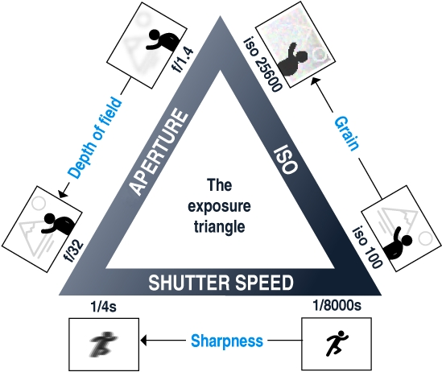
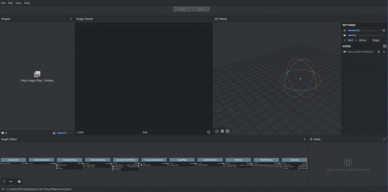
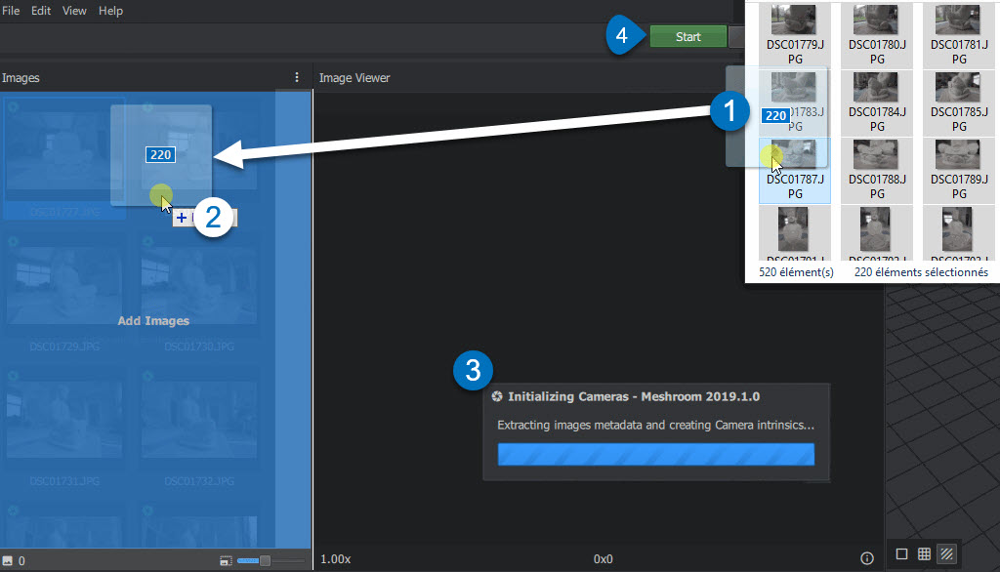
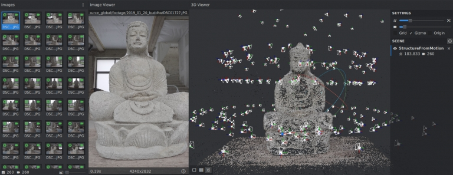
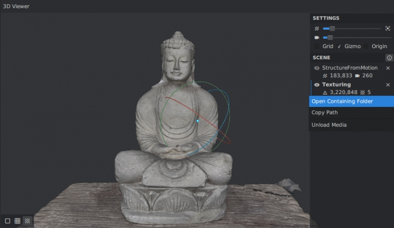
.. |image5| image:: image2-2.jpg
   :target: image2-2.jpg
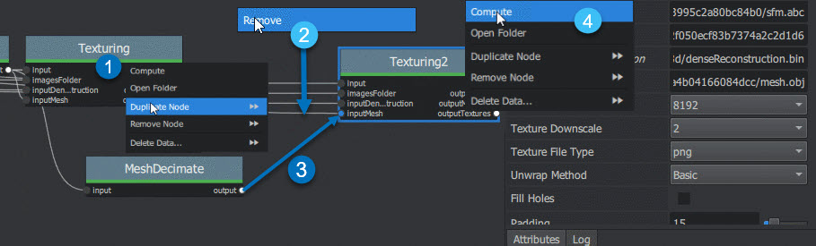
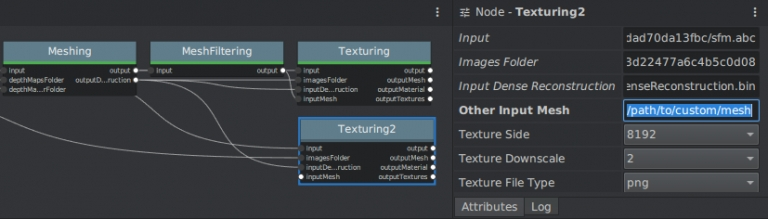
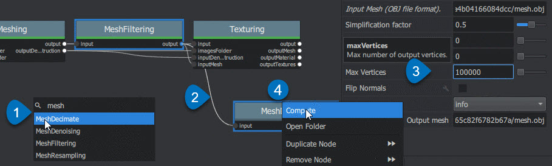
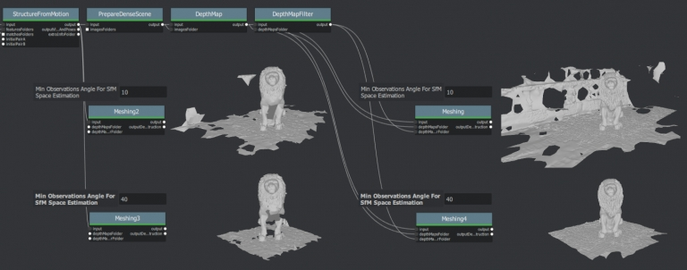
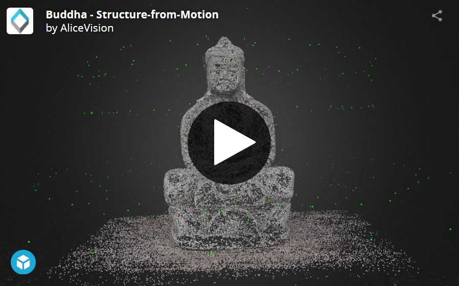
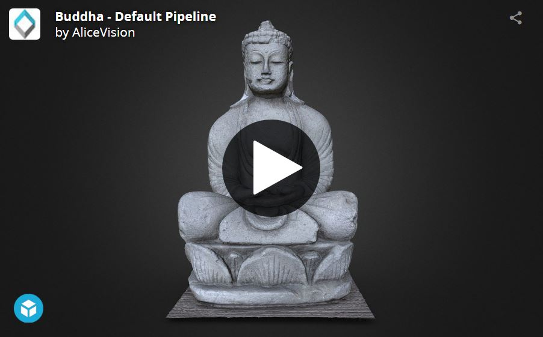
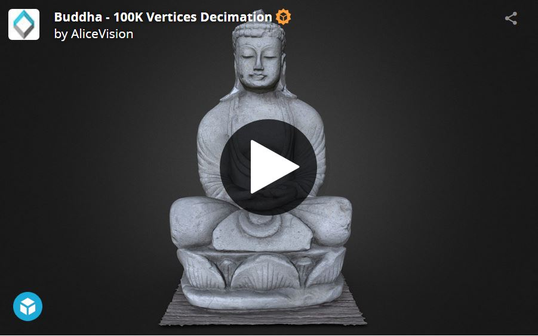
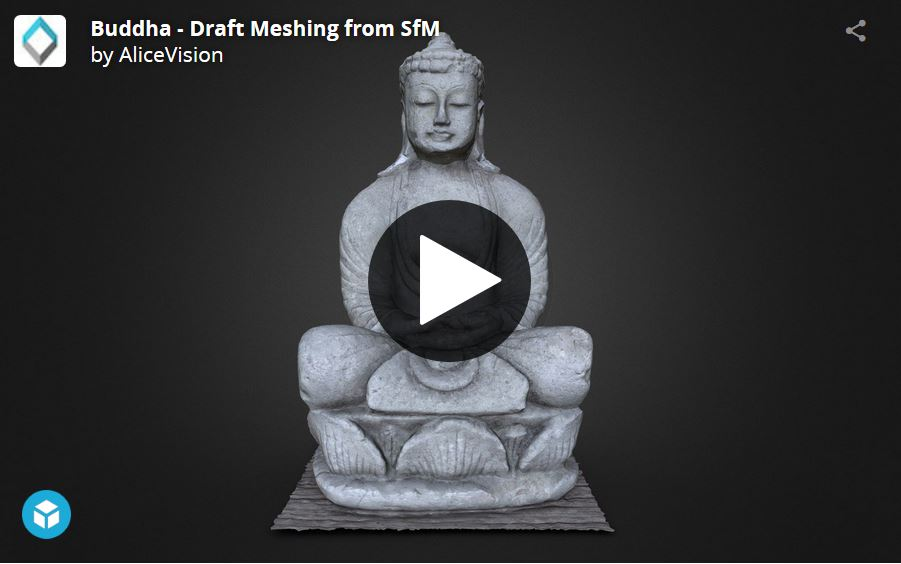
